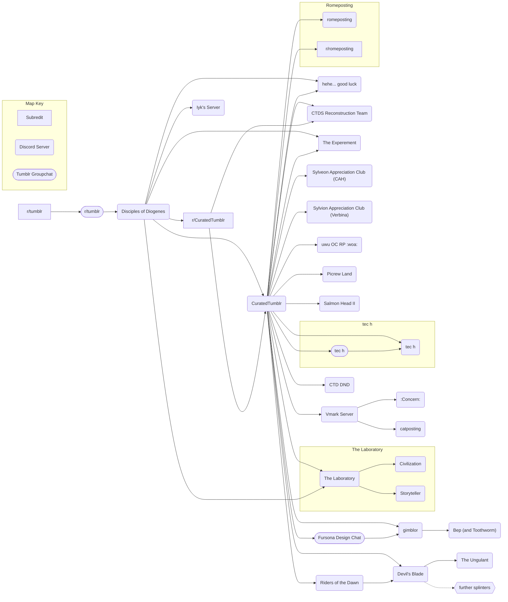

```mermaid
flowchart LR
    tumblr[r/tumblr] --> groupchat([r/tumblr])
    groupchat --> DoD(Disciples of Diogenes)
    DoD --> subreddit[r/CuratedTumblr]
    DoD --> CTDS(CuratedTumblr)
    subreddit --> CTDS
    DoD --> Iyk(Iyk's Server)
    DoD --> luck(hehe... good luck)
    CTDS --> luck
    CTDS --> reconstruction(CTDS Reconstruction Team)
    subreddit --> reconstruction
    CTDS --> lab(The Laboratory)
    DoD --> lab
    subgraph Laboratory [The Laboratory]
        lab --> Civilization(Civilization)
        lab --> Storyteller(Storyteller)
    end
    DoD --> Experement(The Experement)
    CTDS --> Experement
    CTDS --> CAH("Sylveon Appreciation Club (CAH)")
    CTDS --> Verbina("Sylvion Appreciation Club (Verbina)")
    CTDS --> tech(tec h)
    CTDS --> techchat([tec h])
    subgraph tec[tec h]
        techchat --> tech
    end
    CTDS --> RP(uwu OC RP :woa:)
    CTDS --> picrew(Picrew Land)
    CTDS --> salmon(Salmon Head II)
    CTDS --> Vmark(Vmark Server)
    Vmark --> concern(:Concern:)
    Vmark --> catposting(catposting)
    CTDS --> gimblor(gimblor)
    CTDS --> fursona([Fursona Design Chat])
    fursona --> gimblor
    gimblor --> bep("Bep (and Toothworm)")
    subgraph Romeposting
        rome(romeposting)
        romesub[r/romeposting]
    end
    CTDS --> rome
    CTDS --> romesub
    CTDS --> DND(CTD DND)
    CTDS --> dawn(Riders of the Dawn)
    CTDS --> blade(Devil's Blade)
    dawn --> blade
    blade --> ungulant(The Ungulant)
    blade -.-> further{{further splinters}}
    subgraph Key [Map Key]
        direction LR
        sub[Subredit]
        discord(Discord Server)
        chat([Tumblr Groupchat])
    end
```
