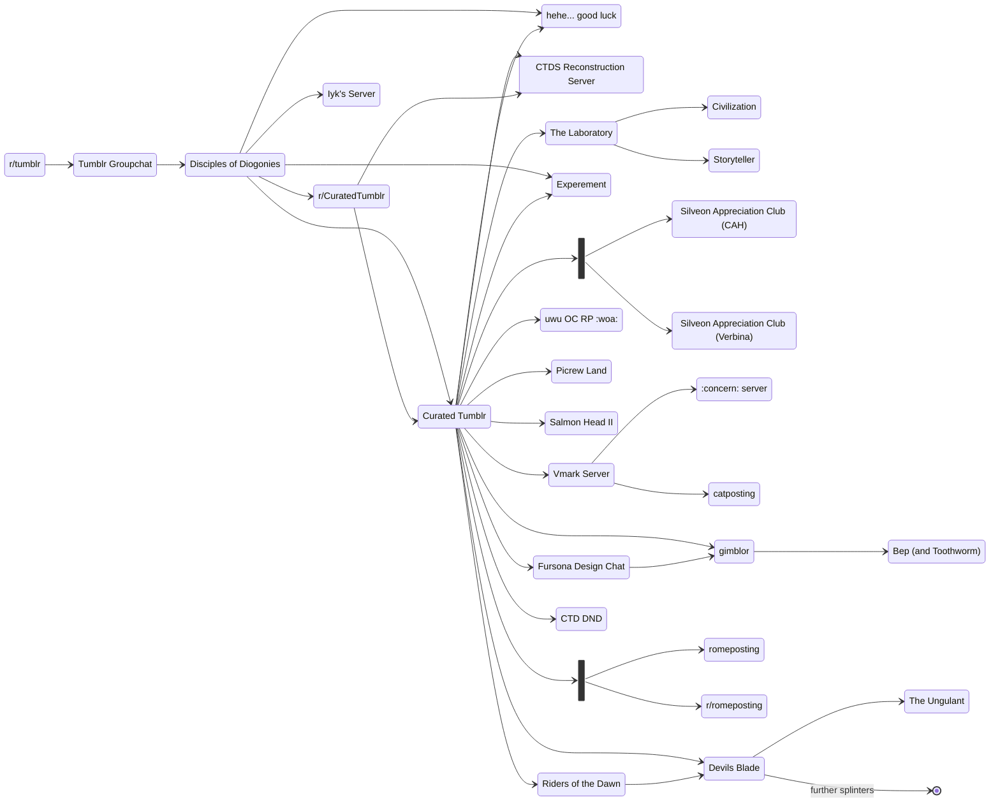

```mermaid
stateDiagram-v2
    direction LR
    state "Tumblr Groupchat" as groupchat
    state "r/tumblr" as tumblr
    tumblr --> groupchat
    state "Disciples of Diogonies" as DoD
    groupchat --> DoD
    DoD --> r/CuratedTumblr
    state "Curated Tumblr" as CTDS
    DoD --> CTDS
    r/CuratedTumblr --> CTDS
    state "Iyk's Server" as Iyk
    DoD --> Iyk
    state "hehe... good luck" as luck
    DoD --> luck
    CTDS --> luck
    state "CTDS Reconstruction Server" as reconstruction
    CTDS --> reconstruction
    r/CuratedTumblr --> reconstruction
    state "The Laboratory" as lab
    CTDS --> lab
    lab --> Civilization
    lab --> Storyteller
    DoD --> Experement
    CTDS --> Experement
    state silveon <<fork>>
    CTDS --> silveon
    state "Silveon Appreciation Club (CAH)" as CAH
    silveon --> CAH
    state "Silveon Appreciation Club (Verbina)" as Verbina
    silveon --> Verbina
    state "uwu OC RP :woa:" as RP
    CTDS --> RP
    state "Picrew Land" as picrew
    CTDS --> picrew
    state "Salmon Head II" as salmon
    CTDS --> salmon
    state "Vmark Server" as Vmark
    CTDS --> Vmark
    state ":concern: server" as concern
    Vmark --> concern
    Vmark --> catposting
    CTDS --> gimblor
    state "Fursona Design Chat" as fursona
    CTDS --> fursona
    fursona --> gimblor
    state "Bep (and Toothworm)" as bep
    gimblor --> bep
    state rome <<fork>>
    CTDS --> rome
    rome --> romeposting
    rome --> r/romeposting
    state "CTD DND" as DND
    CTDS --> DND
    state "Riders of the Dawn" as dawn
    CTDS --> dawn
    state "Devils Blade" as blade
    CTDS --> blade
    dawn --> blade
    state "The Ungulant" as ungulant
    blade --> ungulant
    blade --> [*]:further splinters
```
